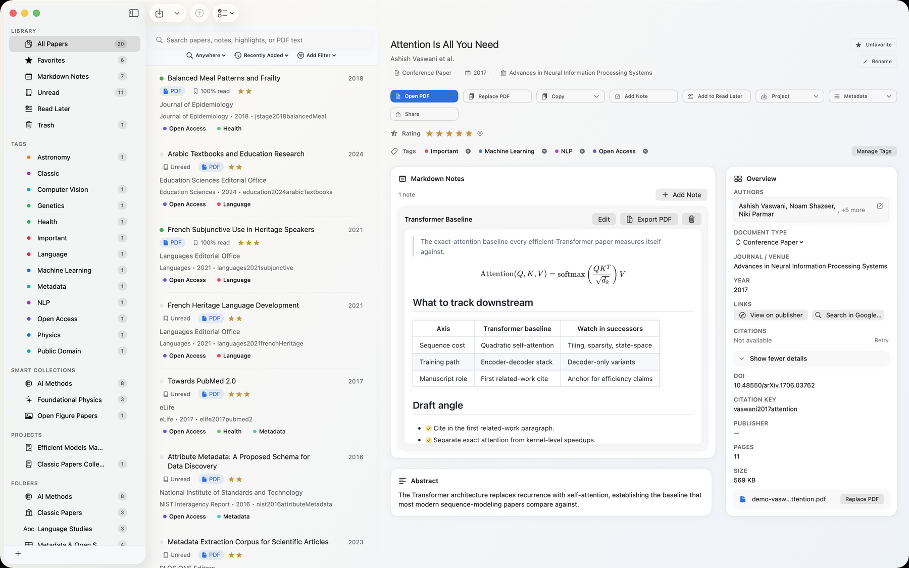
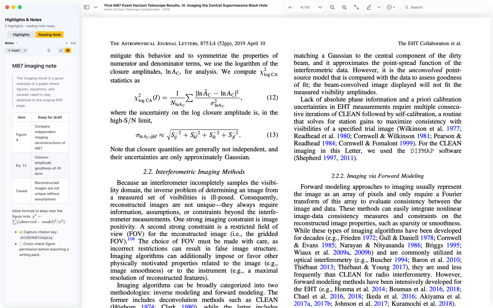
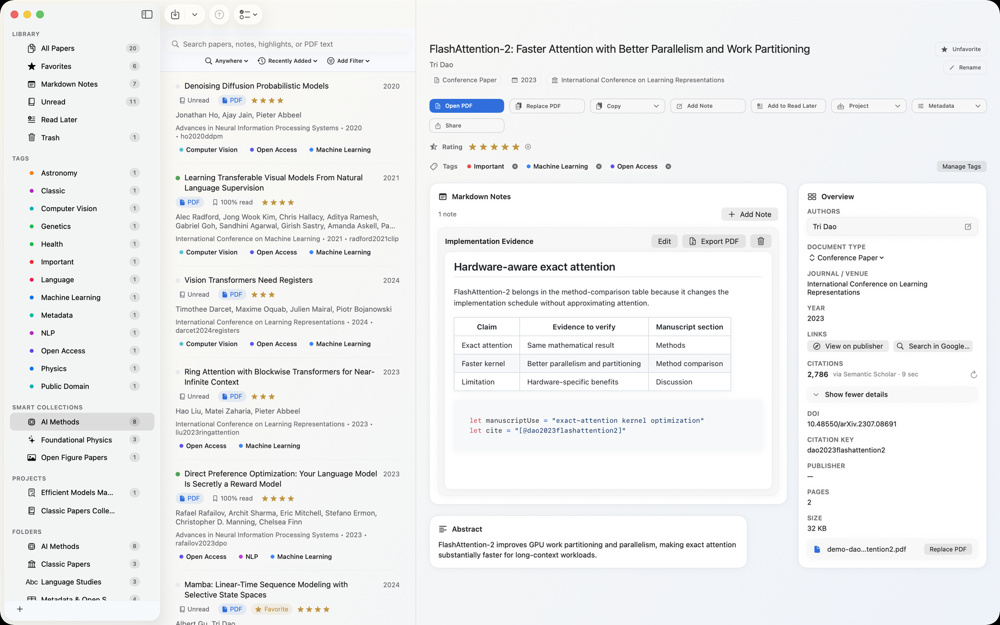
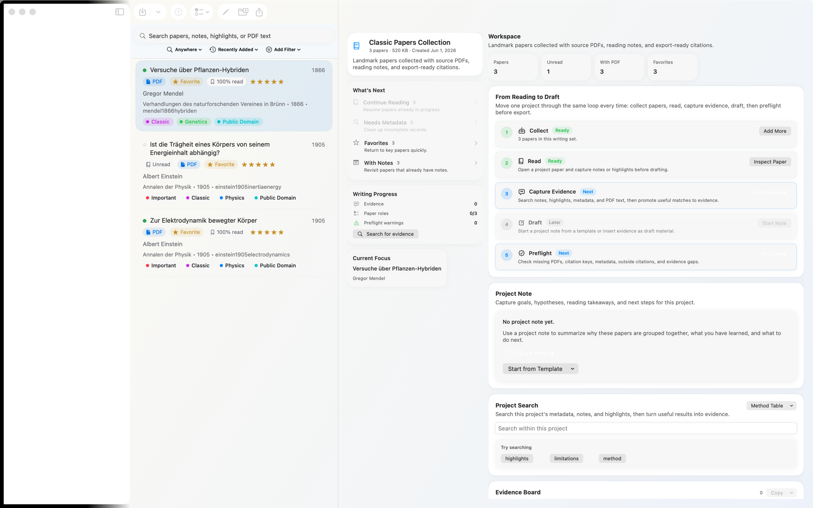
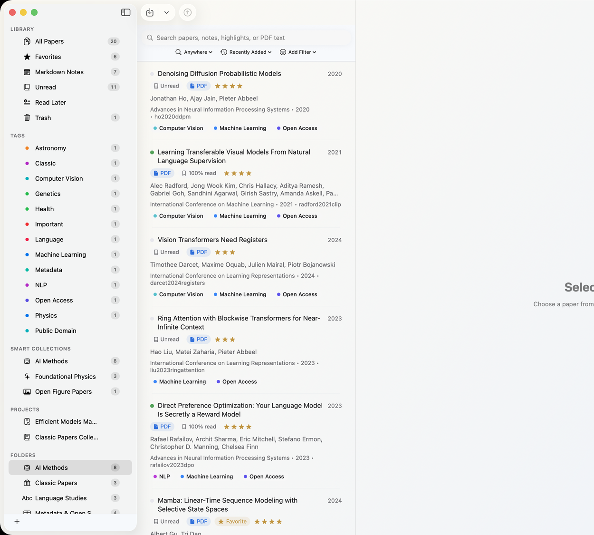

# Papyrus Papers

A native, local-first research library and PDF manager for macOS.

Papyrus Papers is built for researchers, graduate students, engineers, and anyone who works through large collections of academic PDFs. It brings importing, metadata cleanup, reading, annotation, notes, search, citation export, and backup into one Mac-native workspace while keeping your library local by default.

[Features](#features) · [Install](#install) · [Quick Start](#quick-start) · [Shortcuts](#default-shortcuts) · [Screenshots](#screenshots) · [Roadmap](#roadmap) · [Privacy](#privacy) · [License](#license)

---

## Features

### Research Library

- Import PDFs, folders, DOIs, arXiv IDs, BibTeX files, and RIS files.
- Drag PDFs or folders from Finder into the library window.
- Recursively import folders and mirror the source structure inside Papyrus Papers.
- Choose whether PDFs are linked in place or copied into the managed library.
- Organize papers with folders, projects, tags, favorites, read / unread state, Read Later, and Smart Collections.
- Store the library locally with SwiftData and app-group storage.

### PDF Reading & Annotation

- Open PDFs in a dedicated native reader window or hand them off to the system default PDF app.
- Use PDFKit-backed reading with page bookmarks and resume state.
- Highlight, underline, strikethrough, add note annotations, and place free-text blocks.
- Import existing PDF annotations from Preview, PDF Expert, and other PDF apps when possible.
- Browse annotations in a Highlights & Notes inspector, filter by color, edit comments, and retint markup.
- Keep paper-linked Markdown notes beside the reader.

### Metadata, Search & Organization

- Extract identifiers and metadata from imported PDFs where possible.
- Query open metadata sources including Crossref, arXiv, Semantic Scholar, OpenAlex, OpenLibrary, NCBI / PubMed / PMC, Zenodo, DOI links, and embedded XMP.
- Preserve per-field provenance and show conflicts when sources disagree.
- Edit metadata manually when automatic extraction is incomplete.
- Detect duplicate imports using normalized title and file-size signals.
- Search metadata, tags, projects, notes, annotations, and indexed PDF text.
- Index papers into macOS Spotlight so library items can appear in system search.

### Notes, Citations & Export

- Write Markdown notes per paper with headings, task lists, tables, block quotes, code fences, links, images, footnotes, table of contents, and LaTeX math.
- Open notes beside the PDF, in the detail panel, or in an independent note window.
- Copy citations in APA 7, MLA 9, Chicago 17, IEEE, Harvard, Vancouver, BibTeX, and RIS formats.
- Export a writing pack with citation, BibTeX, notes, and annotation evidence.
- Export Markdown notes for use in Obsidian, Apple Notes, or another knowledge base.
- Export projects as bundles containing PDFs, BibTeX, RIS, and optional Markdown notes.

### Optional Apple Intelligence Support

- Papyrus Papers can use Apple Foundation Models on supported Macs and locales for metadata and abstract extraction support.
- These paths are optional and fall back to deterministic PDF parsing and non-AI heuristics when unavailable.
- Papyrus Papers does not operate a hosted AI backend.
- AI is not required for importing, reading, search, notes, sync, or export.

### Privacy & Local-first

- PDFs, notes, metadata, annotations, reading state, full-text indexes, and backups stay on your Mac by default.
- No Papyrus Papers account is required.
- No analytics, telemetry, or crash-report SDK is shipped by default.
- Network access is limited to user-initiated metadata lookup, DOI links, optional WebDAV sync, and Apple-provided system intelligence where available.
- WebDAV sync is optional and uses the server you configure.

### macOS Native Workflow

- SwiftUI interface designed for macOS Sequoia.
- Native menus, keyboard shortcuts, drag-and-drop import, Finder reveal, share sheet, and Settings panes.
- Configurable shortcuts in Settings -> Shortcuts with conflict detection.
- Automatic local backups and a Storage settings pane for backup management.
- Built for Apple Silicon and Intel Macs.

---

## Install

Papyrus Papers is distributed through the Mac App Store.

The public App Store listing is not live yet. When Apple publishes it, this page will link directly to the store listing:

[Check App Store availability](https://zendax673.github.io/papyrus-release/download.html)

The Mac App Store is the only public download path.

---

## Requirements

- macOS 15.6 Sequoia or later
- Apple Silicon or Intel Mac
- Disk space for your PDFs, metadata, notes, annotations, full-text indexes, and backups
- Optional: a WebDAV-compatible server if you want library sync across Macs

Large libraries are mostly limited by the PDFs you import. The app itself is small compared with a real research archive.

---

## Quick Start

1. Launch Papyrus Papers.
2. Import PDFs, a folder, a DOI / arXiv ID, a BibTeX file, or a RIS file.
3. Choose whether to link PDFs in place or copy them into the managed library.
4. Review extracted metadata and resolve conflicts when needed.
5. Organize papers with folders, projects, tags, favorites, Read Later, and Smart Collections.
6. Open a PDF in the native reader.
7. Add highlights, annotations, bookmarks, and Markdown notes.
8. Search metadata, notes, annotations, and PDF full text.
9. Export citations, notes, or project bundles when you are ready to write.

---

## Default Shortcuts

| Shortcut | Action |
| --- | --- |
| `Command + F` | Find in the active view |
| `Command + I` | Import PDFs |
| `Command + O` | Open PDF |
| `Shift + Command + R` | Refresh library metadata |
| `Command + D` | Toggle favorite |
| `Shift + Command + T` | Manage tags |
| `Option + Command + U` | Toggle read / unread |
| `Command + Delete` | Move selection to Trash |
| `Shift + Command + /` | Open Papyrus Papers Help |

Shortcuts can be changed in Settings -> Shortcuts. Conflicts are detected and cleared automatically.

---

## Screenshots

### Library View

### PDF Reader

### Smart Collections

### Projects

### Folders

---

## Roadmap

### Implemented in the current app build

- PDF, folder, DOI / arXiv, BibTeX, and RIS import
- Link-in-place and copy-into-library PDF storage modes
- Metadata enrichment, provenance, and conflict picking
- Duplicate detection for imports
- Folders, projects, tags, favorites, Read Later, and Smart Collections
- Native PDF reader with highlights, note annotations, free text, bookmarks, and annotation inspector
- Paper-linked Markdown notes
- Citation copying and project export
- Full-text PDF indexing and search
- Core Spotlight indexing
- Automatic local backups and manual backup creation
- Optional WebDAV sync, restore, and connection testing
- Configurable keyboard shortcuts
- StoreKit 2 lifetime unlock and 30-day trial flow

### In progress for public release

- Mac App Store listing and release packaging
- App Store review polish
- Documentation cleanup for public users
- Import and metadata reliability hardening
- Reader and annotation polish

### Planned after 1.0

- Continued metadata-source improvements
- More export workflow polish
- More keyboard-first library actions
- Large-library performance tuning
- Safer use of Apple Foundation Models where they improve metadata extraction without changing the local-first model

Roadmap items may change based on App Store review, bug reports, and real research workflows.

---

## Repository

This repository hosts the public release materials for Papyrus Papers:

- Marketing site: <https://zendax673.github.io/papyrus-release/>
- Download status: <https://zendax673.github.io/papyrus-release/download.html>
- Privacy policy: <https://zendax673.github.io/papyrus-release/privacy.html>
- Terms: <https://zendax673.github.io/papyrus-release/terms.html>
- Support: <https://zendax673.github.io/papyrus-release/support.html>
- FAQ and changelog

It is not an alternate app distribution channel. Please use the Mac App Store build when it becomes available.

---

## Contributing

Issues and feature requests are welcome:

<https://github.com/zendax673/papyrus-release/issues>

For bug reports, include:

- macOS version
- Papyrus Papers version, build number, or commit hash
- Steps to reproduce
- Whether the issue involves import, metadata, PDF reading, annotations, notes, search, export, sync, backup, or purchase
- Whether the PDF was linked in place or copied into the library

Research workflow suggestions are especially useful. If Zotero, Papers, Mendeley, ReadCube, DEVONthink, Obsidian, Finder folders, or a custom setup already works for part of your process, describe what works and where it breaks down.

---

## Privacy

Papyrus Papers is designed as a local-first research tool.

By default:

- Your PDFs stay on your Mac.
- Your notes stay on your Mac.
- Your annotations stay on your Mac.
- Your metadata database stays on your Mac.
- Your reading state stays on your Mac.
- Your full-text index stays on your Mac.
- Your backups stay on your Mac.

Network access is limited to features you explicitly use, such as metadata lookup, DOI links, optional WebDAV sync, or Apple-provided system intelligence on supported Macs.

Read the full policy here: <https://zendax673.github.io/papyrus-release/privacy.html>

---

## License

This public release repository is licensed under the MIT License. See [LICENSE](LICENSE) for details.
